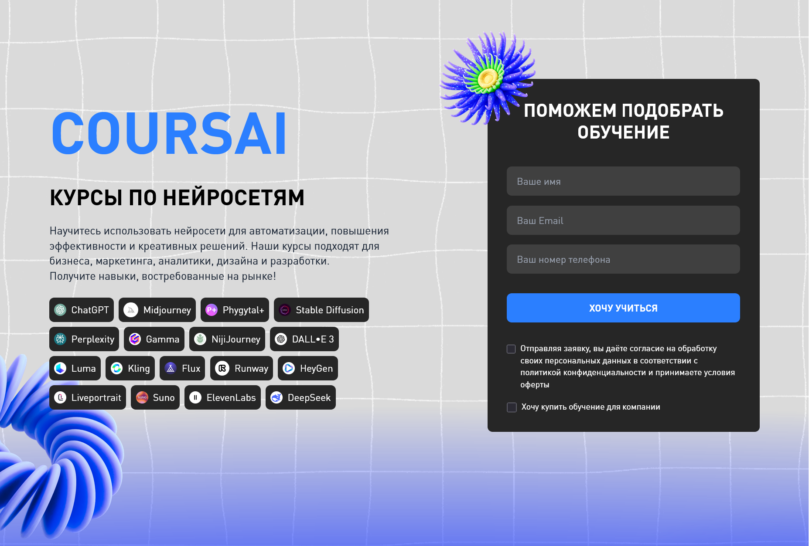
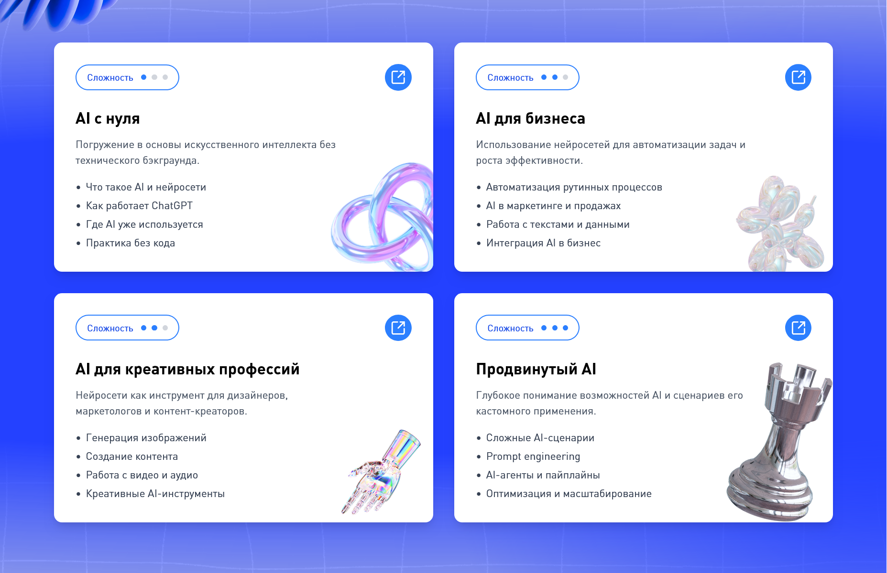

# ⚠️ ВАЖНОЕ ПРЕДУПРЕЖДЕНИЕ

**ЭТО УЧЕБНЫЙ ПРОЕКТ ДЛЯ ПОРТФОЛИО**

> ❗ Этот репозиторий создан исключительно в образовательных целях.  
> Он не является коммерческим продуктом и не используется в продакшене.

---

## ❌ Ограничения и условия

1. 🚫 **НЕ КОММЕРЧЕСКИЙ ПРОЕКТ** — используется только для демонстрации навыков  
2. 🎨 **ДИЗАЙН ВЗЯТ ИЗ ОТКРЫТЫХ ИСТОЧНИКОВ** — все бренды удалены или заменены  
3. 🧪 **НЕ ДЛЯ ПРОДАКШЕНА** — код не оптимизирован под реальные бизнес-задачи  
4. 📩 **СВЯЗЬ ДЛЯ УДАЛЕНИЯ КОНТЕНТА**: https://t.me/tegalex15  

---

# 🎓 COURSAI  
## Учебный frontend-лендинг образовательной платформы

**COURSAI** — учебный frontend-проект современного лендинга, посвящённого обучению использованию искусственного интеллекта.

Проект создан как **практическая песочница** для:
- архитектуры компонентов
- UI / UX решений
- форм и валидации
- анимаций
- адаптивной вёрстки

> ⚠️ **Важно**  
> Дизайн-концепция и визуальное вдохновение взяты из открытых источников.  
> Проект не связан с реальными компаниями или брендами.

---

## ✨ Визуальная концепция

- 🎨 Тёмная тема с акцентными градиентами
- 🌈 Радиальные и фоновые градиенты
- 🧩 Крупные карточки с визуальной иерархией
- ✨ Микро-анимации состояний
- 🌀 Плавные переходы между состояниями UI

## Скриншоты



---

## 🎯 Цели проекта

Проект создавался не «для галочки», а как имитация реального frontend-заказа.

**Основные цели:**

- 🔧 Практика современного frontend-стека
- 🧠 Осознанная архитектура компонентов
- ♻️ Минимизация дублирования кода
- 📱 Адаптивность и responsive layout
- 🧑‍💻 UX-ориентированный подход

---

## 🧠 Концепция COURSAI

COURSAI — концептуальная образовательная платформа по работе с AI.

> Используйте нейросети для автоматизации, креатива и повышения эффективности.

**Тематики курсов:**
- AI для бизнеса и автоматизации
- AI в маркетинге и аналитике
- Нейросети в дизайне
- AI-инструменты для разработчиков

---

## 🛠 Технологический стек

| Категория | Используется |
|---------|-------------|
| UI | React 18 |
| Язык | TypeScript |
| Сборка | Vite |
| Стили | Tailwind CSS |
| Формы | React Hook Form |
| Валидация | Zod |
| Анимации | Framer Motion |
| Иконки | Lucide React |

---

## 🧩 Реализовано

### 🖼 Интерфейс
- Современный лендинг
- Адаптивная сетка
- Hero-секция с формой
- Карточки курсов
- Градиентные фоновые секции

### 🧠 Технически
- Компонентная архитектура
- Zod-схемы в отдельном слое
- Плавное появление ошибок
- Чистые, переиспользуемые UI-компоненты
- Минимум логики в JSX

---

## 🚀 Установка и запуск

### Требования
- Node.js 18+

### Запуск

```bash
git clone https://github.com/TeGaLeX15/coursai.git
cd coursai
npm install
npm run dev
```

### Сборка

```bash
npm run build
```

---

## 🗂 Структура проекта

```txt
src/
├── assets/          # Изображения и ресурсы
├── components/      # UI и секции
│   ├── UI/
│   ├── Hero/
│   ├── CardSection/
│   └── Gradient/
├── data/            # Константы
├── schemas/         # Zod-схемы
├── App.tsx
├── main.tsx
└── index.css
```

---

## 🧪 Что практиковалось

### React / TypeScript
- Типизация форм и компонентов
- Разделение ответственности
- Рефакторинг и упрощение

### UX / UI
- Микро-анимации
- Плавная валидация
- Стабильные layout'ы без прыжков
- Визуальный баланс

---

## 📚 Итог

COURSAI — это **не просто лендинг**, а:

- тренировка архитектурного мышления
- работа с деталями интерфейса
- демонстрация подхода к качественному frontend-коду

---

## 🧭 Планы развития

- [ ] Новые секции лендинга  
- [ ] Интерактивные элементы  
- [ ] Мультиязычность  
- [ ] Тестирование компонентов  
- [ ] Улучшение адаптивности  

---

## 🖤 Автор

Frontend-разработка, архитектура, стилизация — **TeGaLeX15**

📩 Telegram: https://t.me/tegalex15
